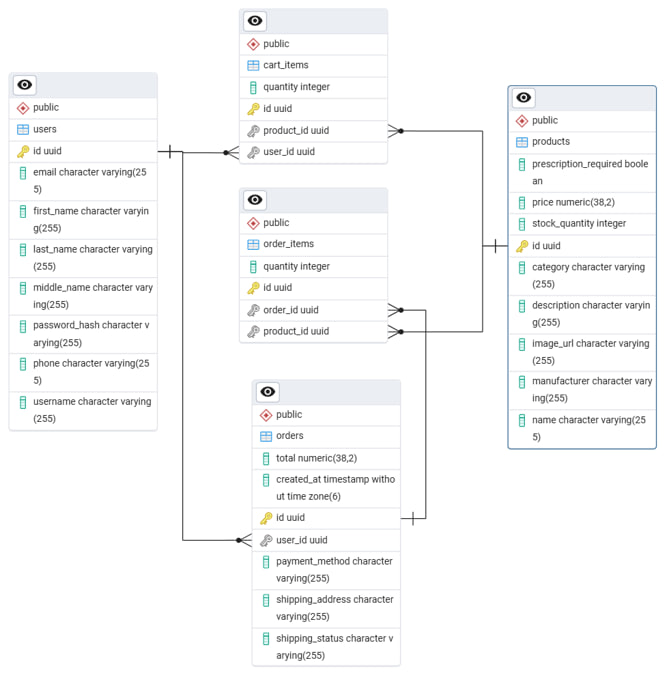

# 💊 Pharmacy Management System

A cross-platform web application designed to automate pharmacy store operations, manage inventory, and process customer orders.

The backend is built with **Java** and **Spring Boot**, while the frontend utilizes responsive **HTML/CSS/JS** dynamic templates powered by **Thymeleaf**.

---

## 🚀 Features

### Client Facing
* **Interactive Catalog:** Browse medicines with dynamic filtering by category, stock availability, and prescription requirements.
* **Smart Search & Sort:** Instantly search products by name and sort them by price.
* **Shopping Cart:** Full cart lifecycle management (add, update quantities, remove items).
* **Checkout Integration:** Streamlined order placement with integrated **Yandex Maps API** for precise delivery address selection.
* **Secure Authentication:** User registration and persistent login sessions.

### Administrative Panel
* **User Management:** Full CRUD operations for system users and role assignments.
* **Product Catalog Management:** Inventory control via product CRUD interfaces.
* **Order Processing:** Advanced dashboard to view orders, update delivery statuses, adjust payment methods, and edit fulfillment details.

---

## 🛠 Tech Stack

* **Core:** Java 21 / Spring Boot 3.2.0
* **Security:** Spring Security
* **Data & Persistence:** Spring Data JPA / PostgreSQL
* **Template Engine:** Thymeleaf
* **Build Tool:** Gradle
* **DevOps:** Docker / Docker Compose
* **API Integration:** Yandex Maps API

---

## 🔧 Installation & Quick Start

### Prerequisites
Make sure you have [Docker](https://docker.com) and [Docker Compose](https://docker.com) installed on your machine.

### Deployment via Docker Compose (Recommended)

The entire environment is fully containerized. You do not need to install local databases or build tools manually.

1. **Clone the repository:**
   ```bash
   git clone https://github.com
   cd pharmacy-spring
   ```

2. **Spin up the environment:**
   ```bash
   docker-compose up --build
   ```

3. **Access the application:**
    * Open your browser and navigate to: `http://localhost:8080`
    * **Admin Credentials:**
        * *Username:* `admin@selderey.ru`
        * *Password:* `admin`

---

## 🌄 Application Demonstration

### 🎞 UI & Feature Walkthrough
Below is a demonstration of the core workflow: browsing the medicine catalog, filtering products, managing the shopping cart, and selecting a delivery address using the integrated Yandex Maps API.

<p align="center">
  
  <br>
  <em>Figure 1: Core user workflow from product selection to checkout with Map API integration.</em>
</p>

### 📊 Database Architecture
The application uses **PostgreSQL** as its relational database. Below is the Entity-Relationship (ER) diagram showing the database schema and table relationships (Users, Roles, Products, Orders, and Cart state).

<p align="center">
  
  <br>
  <em>Figure 2: PostgreSQL relational database entity layout.</em>
</p>
